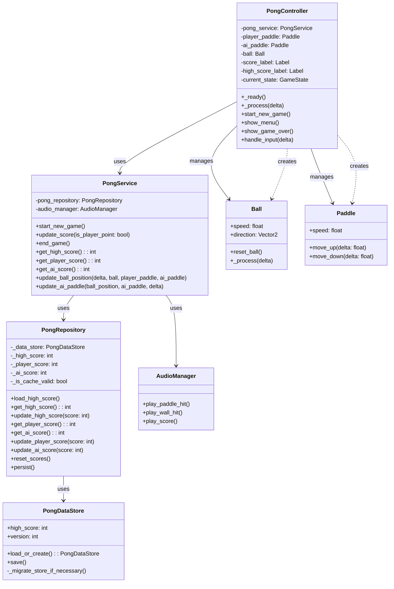

# Feature-Based Game Architecture: Best Practices and Guidelines

## Table of Contents

1. Introduction
2. Core Principles
3. Architecture Overview
4. Component Breakdown
5. Communication Patterns
6. Data Management
7. Best Practices
8. Scalability and Extensibility
9. Testing Strategies
10. Performance Considerations
11. Common Pitfalls and How to Avoid Them
12. Case Studies and Examples
13. Conclusion

## 1. Introduction

This document outlines a feature-based architecture designed for complex game development projects. It provides a flexible, modular approach that emphasizes clean code, separation of concerns, and scalability. While primarily focused on game development, many principles can be applied to other complex software projects.

## 2. Core Principles

- Feature-Centric Organization: Structure code around game features rather than technical layers.
- Modularity: Each feature should be self-contained with minimal dependencies on other features.
- Separation of Concerns: Clearly define responsibilities for each component within a feature.
- Scalability: Design for easy addition of new features and expansion of existing ones.
- Testability: Ensure all components can be easily unit tested.
- Flexibility: Allow for different implementation strategies within the same architectural framework.

## 3. Architecture Overview

The architecture is built around feature modules, each containing:

- Controller: Handles UI and input
- Service: Contains business logic
- Repository: Manages data access
- DataStore: Handles data persistence

Global components include:

- EventBus: Manages cross-feature communication
- ServiceLocator: Provides centralized service access
- DataStoreManager: Coordinates data persistence across features

## 4. Component Breakdown

### Controller

- Responsibility: UI management and input handling
- Guidelines:
  - Keep UI logic separate from business logic
  - Use dependency injection to access services
  - Emit signals for local communication within the feature

### Service

- Responsibility: Business logic and feature-specific operations
- Guidelines:
  - Implement core feature functionality here
  - Use repositories for data access
  - Avoid direct UI manipulation

### Repository

- Responsibility: Data access and management
- Guidelines:
  - Abstract data operations from services
  - Handle in-memory data storage and retrieval
  - Coordinate with DataStore for persistence

### DataStore

- Responsibility: Data persistence
- Guidelines:
  - Handle saving and loading of feature-specific data
  - Implement caching strategies where appropriate
  - Use appropriate storage methods (files, databases) based on data characteristics

## 5. Communication Patterns

- Dependency Injection: Use for connecting components within a feature
- Direct Signals: For local communication within a feature
- EventBus: For cross-feature communication and global state changes
- Service Calls: For direct communication between services when necessary

## 6. Data Management

- Each feature should have its own data management strategy
- Use repositories for in-memory data handling
- Implement DataStores for persistent storage
- Consider different storage strategies based on data type and access patterns
- Use a DataStoreManager for coordinating game-wide data operations

## 7. Best Practices

- Single Responsibility Principle: Each class should have one primary responsibility
- Dependency Inversion: Depend on abstractions, not concretions
- Open/Closed Principle: Open for extension, closed for modification
- Don't Repeat Yourself (DRY): Avoid code duplication
- KISS (Keep It Simple, Stupid): Favor simple solutions over complex ones
- Composition over Inheritance: Use composition to build complex behaviors
- Fail Fast: Detect and report errors as early as possible

## 8. Scalability and Extensibility

- Design features as self-contained modules
- Use interfaces and abstract classes to define contracts between components
- Implement feature flags for easy enabling/disabling of features
- Design systems to be easily expandable (e.g., new monster types, quest types)
- Use configuration files for easily modifiable game parameters

## 9. Testing Strategies

- Unit Testing: Test individual components in isolation
- Integration Testing: Test interactions between components within a feature
- System Testing: Test entire features and cross-feature interactions
- Mock dependencies to isolate components during testing
- Use dependency injection to facilitate easier testing
- Implement continuous integration to run tests automatically

## 10. Performance Considerations

- Profile code regularly to identify bottlenecks
- Optimize data structures and algorithms in performance-critical sections
- Implement object pooling for frequently created/destroyed objects
- Use appropriate data storage methods (in-memory, disk, database) based on access patterns
- Consider multi-threading for performance-intensive operations
- Implement level-of-detail (LOD) systems for complex game worlds

## 11. Common Pitfalls and How to Avoid Them

- Tight Coupling: Use dependency injection and stick to defined interfaces
- God Objects: Break down large, multi-purpose classes into smaller, focused ones
- Feature Creep: Clearly define feature scope and use agile methodologies
- Premature Optimization: Profile first, optimize where necessary
- Inconsistent Style: Use a style guide and automated formatting tools
- Poor Documentation: Document as you go, use clear naming conventions

## 12. Case Studies and Examples

This section provides concrete examples of how our feature-based architecture can be implemented in real-world scenarios. We'll explore three different features: a Quest System, an Inventory System, and a Crafting System. Each example will demonstrate key aspects of our architecture, incorporating practices from the provided code.

### 12.1 Quest System

The Quest System manages available quests, tracks progress, and handles completion.

#### QuestController

```gdscript
extends Control

@onready var quest_list = $QuestList
@onready var accept_button = $AcceptButton

var quest_service: QuestService

func _init(q_quest_service: QuestService):
    quest_service = q_quest_service

func _ready():
    accept_button.connect("pressed", self, "_on_accept_button_pressed")
    quest_service.connect("active_quests_changed", self, "_on_active_quests_changed")
    update_quest_list()

func _on_accept_button_pressed():
    var selected_quest = quest_list.get_selected_quest()
    if selected_quest:
        var success = quest_service.accept_quest(selected_quest)
        if success:
            update_quest_list()

func _on_active_quests_changed(active_quests):
    update_quest_list()

func update_quest_list():
    var quests = quest_service.get_all_quests()
    quest_list.update_quests(quests)
```

#### QuestService

```gdscript
class_name QuestService
extends Node

signal quest_updated(quest: Quest)
signal active_quests_changed(active_quests: Array[Quest])

var quest_repository: QuestRepository
var player_service: PlayerService

func _init(q_quest_repo: QuestRepository, p_player_service: PlayerService) -> void:
    quest_repository = q_quest_repo
    player_service = p_player_service

func get_quest(quest_id: String) -> Quest:
    return quest_repository.fetch_by_id(quest_id)

func get_all_quests() -> Array[Quest]:
    return quest_repository.fetch_all()

func get_active_quests() -> Array[Quest]:
    return quest_repository.fetch_active_quests()

func accept_quest(quest: Quest) -> bool:
    if player_service.can_accept_quest(quest):
        quest_repository.add_active_quest(quest)
        active_quests_changed.emit(get_active_quests())
        save_changes()
        return true
    return false

func complete_quest(quest: Quest) -> void:
    quest_repository.remove_active_quest(quest.id)
    player_service.add_experience(quest.reward_experience)
    player_service.add_money(quest.reward_money)
    active_quests_changed.emit(get_active_quests())
    quest_updated.emit(quest)
    save_changes()

func save_changes() -> void:
    quest_repository.persist()
```

#### QuestRepository

```gdscript
class_name QuestRepository
extends Node

var _data_store: QuestDataStore
var _cache: Dictionary = {}
var _active_quests_cache: Dictionary = {}
var _is_cache_valid: bool = false

func _init(data_store: QuestDataStore) -> void:
    _data_store = data_store

func load_all() -> void:
    _cache = _data_store.quests.duplicate(true)
    _active_quests_cache = _data_store.active_quests.duplicate(true)
    _is_cache_valid = true

func fetch_by_id(quest_id: String) -> Quest:
    if not _is_cache_valid:
        load_all()
    return _cache.get(quest_id)

func fetch_all() -> Array[Quest]:
    if not _is_cache_valid:
        load_all()
    var all: Array[Quest] = []
    all.append_array(_cache.values())
    return all

func fetch_active_quests() -> Array[Quest]:
    if not _is_cache_valid:
        load_all()
    var active: Array[Quest] = []
    active.append_array(_active_quests_cache.values())
    return active

func add_active_quest(quest: Quest) -> void:
    _active_quests_cache[quest.id] = quest
    _is_cache_valid = true

func remove_active_quest(quest_id: String) -> void:
    _active_quests_cache.erase(quest_id)

func persist() -> void:
    _data_store.quests = _cache.duplicate(true)
    _data_store.active_quests = _active_quests_cache.duplicate(true)
    _data_store.save()
```

#### QuestDataStore

```gdscript
class_name QuestDataStore
extends Resource

const SAVE_PATH = "user://data/quests.tres"
const CURRENT_VERSION = 1

@export var quests: Dictionary = {}
@export var active_quests: Dictionary = {}
@export var version: int = CURRENT_VERSION

static func load_or_create() -> QuestDataStore:
    if FileAccess.file_exists(SAVE_PATH):
        var store: QuestDataStore = ResourceLoader.load(SAVE_PATH) as QuestDataStore
        if store:
            store._migrate_store_if_necessary()
            return store

    var new_store: QuestDataStore = QuestDataStore.new()
    new_store.save()
    return new_store

func save() -> void:
    ResourceSaver.save(self, SAVE_PATH)

func clear() -> void:
    quests.clear()
    active_quests.clear()
    save()

func _migrate_store_if_necessary() -> void:
    if version < CURRENT_VERSION:
        match version:
            1:
                _migrate_store_to_v2()

        version = CURRENT_VERSION
        save()

func _migrate_store_to_v2() -> void:
    # Example: Perform store-wide migration
    print("Migrated QuestDataStore to version 2")
```

### 12.2 Inventory System

The Inventory System manages the player's items, including adding, removing, and using items.

#### InventoryDataStore

```gdscript
class_name InventoryDataStore
extends Resource

const SAVE_PATH = "user://data/inventory.tres"
const CURRENT_VERSION = 1

@export var items: Dictionary = {}
@export var version: int = CURRENT_VERSION

static func load_or_create() -> InventoryDataStore:
    if FileAccess.file_exists(SAVE_PATH):
        var store: InventoryDataStore = ResourceLoader.load(SAVE_PATH) as InventoryDataStore
        if store:
            store._migrate_store_if_necessary()
            return store

    var new_store: InventoryDataStore = InventoryDataStore.new()
    new_store.save()
    return new_store

func save() -> void:
    ResourceSaver.save(self, SAVE_PATH)

func clear() -> void:
    items.clear()
    save()

func _migrate_store_if_necessary() -> void:
    if version < CURRENT_VERSION:
        match version:
            1:
                _migrate_store_to_v2()

        version = CURRENT_VERSION
        save()

func _migrate_store_to_v2() -> void:
    # Example: Perform store-wide migration
    print("Migrated InventoryDataStore to version 2")
```

#### InventoryController

```gdscript
extends Control

@onready var item_list = $ItemList
@onready var use_button = $UseButton

var inventory_service: InventoryService

func _init(i_inventory_service: InventoryService):
    inventory_service = i_inventory_service

func _ready():
    use_button.connect("pressed", self, "_on_use_button_pressed")
    inventory_service.connect("inventory_updated", self, "_on_inventory_updated")
    update_inventory_display()

func _on_use_button_pressed():
    var selected_item = item_list.get_selected_item()
    if selected_item:
        inventory_service.use_item(selected_item)

func _on_inventory_updated(items):
    update_inventory_display()

func update_inventory_display():
    var items = inventory_service.get_all_items()
    item_list.clear()
    for item in items:
        item_list.add_item(item.name, item.icon)
```

#### InventoryService

```gdscript
class_name InventoryService
extends Node

signal inventory_updated(items: Array[Item])

var inventory_repository: InventoryRepository
var player_service: PlayerService

func _init(i_inventory_repo: InventoryRepository, p_player_service: PlayerService) -> void:
    inventory_repository = i_inventory_repo
    player_service = p_player_service

func add_item(item: Item) -> void:
    inventory_repository.add(item)
    inventory_updated.emit(get_all_items())
    save_changes()

func remove_item(item_id: String) -> void:
    inventory_repository.remove(item_id)
    inventory_updated.emit(get_all_items())
    save_changes()

func use_item(item: Item) -> void:
    if item.can_be_used():
        player_service.apply_item_effect(item)
        remove_item(item.id)

func get_all_items() -> Array[Item]:
    return inventory_repository.fetch_all()

func save_changes() -> void:
    inventory_repository.persist()
```

#### InventoryRepository

```gdscript
class_name InventoryRepository
extends Node

var _data_store: InventoryDataStore
var _cache: Dictionary = {}
var _is_cache_valid: bool = false

func _init(data_store: InventoryDataStore) -> void:
    _data_store = data_store

func load_all() -> void:
    _cache = _data_store.items.duplicate(true)
    _is_cache_valid = true

func fetch_by_id(item_id: String) -> Item:
    if not _is_cache_valid:
        load_all()
    return _cache.get(item_id)

func fetch_all() -> Array[Item]:
    if not _is_cache_valid:
        load_all()
    var all: Array[Item] = []
    all.append_array(_cache.values())
    return all

func add(item: Item) -> void:
    _cache[item.id] = item
    _is_cache_valid = true

func remove(item_id: String) -> void:
    _cache.erase(item_id)

func persist() -> void:
    _data_store.items = _cache.duplicate(true)
    _data_store.save()
```

### 12.3 Crafting System

The Crafting System allows players to combine items to create new ones.

#### CraftingController

```gdscript
extends Control

@onready var recipe_list = $RecipeList
@onready var craft_button = $CraftButton

var crafting_service: CraftingService

func _init(c_crafting_service: CraftingService):
    crafting_service = c_crafting_service

func _ready():
    craft_button.connect("pressed", self, "_on_craft_button_pressed")
    crafting_service.connect("crafting_result", self, "_on_crafting_result")
    update_recipe_list()

func _on_craft_button_pressed():
    var selected_recipe = recipe_list.get_selected_recipe()
    if selected_recipe:
        crafting_service.craft_item(selected_recipe)

func _on_crafting_result(result):
    if result.success:
        update_recipe_list()
        # Show success message to the player
    else:
        # Show failure message to the player

func update_recipe_list():
    var recipes = crafting_service.get_available_recipes()
    recipe_list.clear()
    for recipe in recipes:
        recipe_list.add_item(recipe.name, recipe.icon)
```

#### CraftingService

```gdscript
class_name CraftingService
extends Node

signal crafting_result(result: Dictionary)

var crafting_repository: CraftingRepository
var inventory_service: InventoryService
var player_service: PlayerService

func _init(c_crafting_repo: CraftingRepository, i_inventory_service: InventoryService, p_player_service: PlayerService) -> void:
    crafting_repository = c_crafting_repo
    inventory_service = i_inventory_service
    player_service = p_player_service

func craft_item(recipe: Recipe) -> Dictionary:
    if can_craft(recipe):
        for ingredient in recipe.ingredients:
            inventory_service.remove_item(ingredient.id)
        var crafted_item = create_item(recipe)
        inventory_service.add_item(crafted_item)
        player_service.add_experience(recipe.experience_reward)
        var result = {"success": true, "item": crafted_item}
        crafting_result.emit(result)
        return result
    return {"success": false, "reason": "Missing ingredients or insufficient skill"}

func can_craft(recipe: Recipe) -> bool:
    var player_items = inventory_service.get_all_items()
    for ingredient in recipe.ingredients:
        if not player_items.has(ingredient):
            return false
    return player_service.has_required_skill(recipe.required_skill)

func get_available_recipes() -> Array[Recipe]:
    var all_recipes = crafting_repository.fetch_all()
    return all_recipes.filter(func(recipe): return can_craft(recipe))

func create_item(recipe: Recipe) -> Item:
    # Logic to create the item, potentially with variable stats based on player skill
    var new_item = Item.new()
    # Set properties based on recipe and player skill
    return new_item
```

#### CraftingRepository

```gdscript
class_name CraftingRepository
extends Node

var _data_store: CraftingDataStore
var _cache: Dictionary = {}
var _is_cache_valid: bool = false

func _init(data_store: CraftingDataStore) -> void:
    _data_store = data_store

func load_all() -> void:
    _cache = _data_store.recipes.duplicate(true)
    _is_cache_valid = true

func fetch_by_id(recipe_id: String) -> Recipe:
    if not _is_cache_valid:
        load_all()
    return _cache.get(recipe_id)

func fetch_all() -> Array[Recipe]:
    if not _is_cache_valid:
        load_all()
    var all: Array[Recipe] = []
    all.append_array(_cache.values())
    return all

func persist() -> void:
    _data_store.recipes = _cache.duplicate(true)
    _data_store.save()
```

#### CraftingDataStore

```gdscript
class_name CraftingDataStore
extends Resource

const SAVE_PATH = "user://data/crafting.tres"
const CURRENT_VERSION = 1

@export var recipes: Dictionary = {}
@export var version: int = CURRENT_VERSION

static func load_or_create() -> CraftingDataStore:
    if FileAccess.file_exists(SAVE_PATH):
        var store: CraftingDataStore = ResourceLoader.load(SAVE_PATH) as CraftingDataStore
        if store:
            store._migrate_store_if_necessary()
            return store

    var new_store: CraftingDataStore = CraftingDataStore.new()
    new_store.save()
    return new_store

func save() -> void:
    ResourceSaver.save(self, SAVE_PATH)

func clear() -> void:
    recipes.clear()
    save()

func _migrate_store_if_necessary() -> void:
    if version < CURRENT_VERSION:
        match version:
            1:
                _migrate_store_to_v2()

        version = CURRENT_VERSION
        save()

func _migrate_store_to_v2() -> void:
    # Example: Perform store-wide migration
    print("Migrated CraftingDataStore to version 2")
```

These examples demonstrate how our feature-based architecture promotes:

1. Modularity: Each feature (Quest, Inventory, Crafting) is self-contained but can interact with others through well-defined interfaces.

2. Separation of Concerns:

   - Controllers handle UI and user input
   - Services contain business logic
   - Repositories manage data access
   - DataStores handle data persistence and versioning

3. Reusability: Services like PlayerService are used across multiple features.

4. Scalability: New quests, items, or recipes can be easily added without changing the core structure.

5. Testability: Each component can be easily unit tested in isolation.

6. Data Persistence: Consistent use of DataStore classes for saving and loading data, with built-in versioning and migration support.

7. Caching: Repositories implement caching mechanisms to improve performance.

8. Event-driven Architecture: Use of signals for local and cross-component communication.

9. Dependency Injection: Services and repositories are injected into controllers and other services, promoting loose coupling.

10. Version Control for Data: Each DataStore includes version tracking and migration methods, allowing for easy updates to data structures as the game evolves.

By following these patterns, you can create complex game systems that are maintainable, extensible, and robust. The architecture allows for easy addition of new features and modification of existing ones, while ensuring that data can be safely persisted and migrated as the game evolves over time.

This approach also facilitates collaborative development, as different team members can work on separate features with minimal conflicts. The clear separation of concerns makes it easier to understand and maintain each part of the system independently.

Remember that while this architecture provides a solid foundation, it should be adapted as necessary to meet the specific needs of your project. Always consider performance implications, especially for mobile or resource-constrained platforms, and be prepared to optimize where necessary.

### 12.4 Pong Game System

This example demonstrates how to implement a simple Pong game using our feature-based architecture. The game will include player controls, AI opponent, score tracking, and high score saving.

#### PongDataStore

```gdscript
class_name PongDataStore
extends Resource

const SAVE_PATH = "user://data/pong_data.tres"
const CURRENT_VERSION = 1

@export var high_score: int = 0
@export var version: int = CURRENT_VERSION

static func load_or_create() -> PongDataStore:
    if FileAccess.file_exists(SAVE_PATH):
        var store: PongDataStore = ResourceLoader.load(SAVE_PATH) as PongDataStore
        if store:
            store._migrate_store_if_necessary()
            return store

    var new_store: PongDataStore = PongDataStore.new()
    new_store.save()
    return new_store

func save() -> void:
    ResourceSaver.save(self, SAVE_PATH)

func _migrate_store_if_necessary() -> void:
    if version < CURRENT_VERSION:
        match version:
            1:
                _migrate_store_to_v2()

        version = CURRENT_VERSION
        save()

func _migrate_store_to_v2() -> void:
    # Example: Add a new property for total games played
    # self.total_games_played = 0
    print("Migrated PongDataStore to version 2")
```

#### PongRepository

```gdscript
class_name PongRepository
extends Node

var _data_store: PongDataStore
var _high_score: int = 0
var _player_score: int = 0
var _ai_score: int = 0
var _is_cache_valid: bool = false

func _init(data_store: PongDataStore) -> void:
    _data_store = data_store

func load_high_score() -> void:
    _high_score = _data_store.high_score
    _is_cache_valid = true

func get_high_score() -> int:
    if not _is_cache_valid:
        load_high_score()
    return _high_score

func update_high_score(score: int) -> void:
    if score > _high_score:
        _high_score = score
        _data_store.high_score = score
        _data_store.save()

func get_player_score() -> int:
    return _player_score

func get_ai_score() -> int:
    return _ai_score

func update_player_score(score: int) -> void:
    _player_score = score

func update_ai_score(score: int) -> void:
    _ai_score = score

func reset_scores() -> void:
    _player_score = 0
    _ai_score = 0

func persist() -> void:
    _data_store.high_score = _high_score
    _data_store.save()
```

#### PongService

```gdscript
class_name PongService
extends Node

signal score_updated(player_score: int, ai_score: int)
signal game_over(final_score: int, is_high_score: bool)

var pong_repository: PongRepository
var audio_manager: AudioManager

func _init(p_pong_repo: PongRepository, p_audio_manager: AudioManager) -> void:
    pong_repository = p_pong_repo
    audio_manager = p_audio_manager

func start_new_game() -> void:
    pong_repository.reset_scores()
    score_updated.emit(pong_repository.get_player_score(), pong_repository.get_ai_score())

func update_score(is_player_point: bool) -> void:
    if is_player_point:
        pong_repository.update_player_score(pong_repository.get_player_score() + 1)
    else:
        pong_repository.update_ai_score(pong_repository.get_ai_score() + 1)

    audio_manager.play_score()
    score_updated.emit(pong_repository.get_player_score(), pong_repository.get_ai_score())

    if pong_repository.get_player_score() >= 11 or pong_repository.get_ai_score() >= 11:
        end_game()

func end_game() -> void:
    var player_score = pong_repository.get_player_score()
    var high_score = pong_repository.get_high_score()
    var is_new_high_score = player_score > high_score
    if is_new_high_score:
        pong_repository.update_high_score(player_score)
    game_over.emit(player_score, is_new_high_score)

func get_high_score() -> int:
    return pong_repository.get_high_score()

func get_player_score() -> int:
    return pong_repository.get_player_score()

func get_ai_score() -> int:
    return pong_repository.get_ai_score()


func move_player_paddle(delta: float) -> void:
    # Implement player paddle movement logic

func update_ai_paddle(ball_position: Vector2, delta: float) -> void:
    # Implement AI paddle movement logic

func update_ball_position(delta: float) -> void:
    # Implement ball movement and collision logic
```

#### PongController

```gdscript
extends Node2D

@onready var player_paddle = $PlayerPaddle
@onready var ai_paddle = $AIPaddle
@onready var ball = $Ball
@onready var score_label = $ScoreLabel
@onready var high_score_label = $HighScoreLabel

var pong_service: PongService

func _init(p_pong_service: PongService):
    pong_service = p_pong_service

func _ready():
    pong_service.connect("score_updated", self, "_on_score_updated")
    pong_service.connect("game_over", self, "_on_game_over")
    start_new_game()

func _process(delta):
    pong_service.move_player_paddle(delta)
    pong_service.update_ai_paddle(ball.position, delta)
    pong_service.update_ball_position(delta)

func _on_score_updated(player_score: int, ai_score: int):
    score_label.text = str(player_score) + " - " + str(ai_score)

func _on_game_over(final_score: int, is_high_score: bool):
    if is_high_score:
        high_score_label.text = "New High Score: " + str(final_score)
    # Show game over screen, option to restart, etc.

func start_new_game():
    pong_service.start_new_game()
    high_score_label.text = "High Score: " + str(pong_service.get_high_score())
    # Reset paddle and ball positions
```

This Pong game example demonstrates:

1. Separation of Concerns:

   - PongController handles the game's visual elements and user input.
   - PongService contains the game logic, including score tracking and game state.
   - PongRepository manages data access and persistence.
   - PongDataStore handles saving and loading of high scores, with version control.

2. Data Persistence: The high score is saved to disk and can be loaded when the game starts.

3. Scalability: It's easy to add new features, such as different AI difficulties or power-ups, by extending the PongService.

4. Testability: Each component (especially PongService) can be unit tested in isolation.

5. Event-driven Architecture: The use of signals (score_updated, game_over) allows for loose coupling between the service and controller.

6. Version Control for Data: The PongDataStore includes version tracking and migration methods, allowing for easy updates to saved data structure as the game evolves.

This architecture allows for easy expansion of the game. For example, you could add:

- Multiple AI difficulties by creating different AI strategy classes.
- A replay system by recording and playing back paddle movements.
- Online multiplayer by extending the PongService to handle network communication.

By following these patterns, even a simple game like Pong can be structured in a way that's maintainable, extensible, and robust.

### 12.4 Pong Game System (continued)

#### Completing the Pong Game

While our example provides the architectural foundation, several components are needed to create a fully functional Pong game. Here's what's missing and how to complete it:

1. Game Objects

   - Ball
   - Player Paddle
   - AI Paddle

2. Game Logic

   - Ball movement and collision detection
   - AI paddle movement
   - Score tracking and win conditions

3. User Interface

   - Start menu
   - In-game UI (score display)
   - Game over screen

4. Sound Effects

Step-by-Step Instructions to Complete the Game:

1. Create Game Objects:

   a. Ball:

   ```gdscript
   class_name Ball
   extends Area2D

   var speed: float = 400.0
   var direction: Vector2 = Vector2.ZERO

   func _ready():
       randomize()
       reset_ball()

   func _process(delta):
       position += direction * speed * delta

   func reset_ball():
       position = Vector2(512, 300)
       direction = Vector2([-1, 1].pick_random(), randf_range(-0.8, 0.8)).normalized()
   ```

   b. Paddle (base class for both player and AI):

   ```gdscript
   class_name Paddle
   extends Area2D

   var speed: float = 400.0

   func move_up(delta: float):
       position.y = max(position.y - speed * delta, 0)

   func move_down(delta: float):
       position.y = min(position.y + speed * delta, 600)
   ```

2. Implement Game Logic in PongService:

   a. Update ball position and handle collisions:

   ```gdscript
   func update_ball_position(delta: float, ball: Ball, player_paddle: Paddle, ai_paddle: Paddle) -> void:
       ball.position += ball.direction * ball.speed * delta

       if ball.position.y <= 0 or ball.position.y >= 600:
           ball.direction.y *= -1

       if ball.overlaps_body(player_paddle) or ball.overlaps_body(ai_paddle):
           ball.direction.x *= -1
           ball.speed += 20  # Increase difficulty

       if ball.position.x <= 0:
           update_score(false)
           ball.reset_ball()
       elif ball.position.x >= 1024:
           update_score(true)
           ball.reset_ball()
   ```

   b. Implement AI paddle movement:

   ```gdscript
   func update_ai_paddle(ball_position: Vector2, ai_paddle: Paddle, delta: float) -> void:
       var paddle_center = ai_paddle.position.y + ai_paddle.height / 2
       if ball_position.y < paddle_center - 10:
           ai_paddle.move_up(delta)
       elif ball_position.y > paddle_center + 10:
           ai_paddle.move_down(delta)
   ```

3. Enhance PongController:

   a. Add input handling for player paddle:

   ```gdscript
   func _process(delta):
       if Input.is_action_pressed("move_up"):
           player_paddle.move_up(delta)
       if Input.is_action_pressed("move_down"):
           player_paddle.move_down(delta)

       pong_service.update_ai_paddle(ball.position, ai_paddle, delta)
       pong_service.update_ball_position(delta, ball, player_paddle, ai_paddle)
   ```

   b. Implement game states (menu, playing, game over):

   ```gdscript
   enum GameState { MENU, PLAYING, GAME_OVER }
   var current_state: GameState = GameState.MENU

   func _ready():
       set_state(GameState.MENU)

   func set_state(new_state: GameState):
       current_state = new_state
       match current_state:
           GameState.MENU:
               show_menu()
           GameState.PLAYING:
               start_new_game()
           GameState.GAME_OVER:
               show_game_over()
   ```

4. Create User Interface:

   a. Start Menu:

   ```gdscript
   func show_menu():
       $MenuContainer.show()
       $GameContainer.hide()
       $GameOverContainer.hide()

   func _on_start_button_pressed():
       set_state(GameState.PLAYING)
   ```

   b. In-game UI:

   ```gdscript
   func update_score_display():
       score_label.text = str(pong_service.player_score) + " - " + str(pong_service.ai_score)
   ```

   c. Game Over Screen:

   ```gdscript
   func show_game_over():
       $GameOverContainer.show()
       $GameContainer.hide()
       $FinalScoreLabel.text = "Final Score: " + str(pong_service.player_score)
       $HighScoreLabel.text = "High Score: " + str(pong_service.get_high_score())

   func _on_play_again_button_pressed():
       set_state(GameState.PLAYING)
   ```

5. Add Sound Effects:

   a. Create an AudioManager:

   ```gdscript
   class_name AudioManager
   extends Node

   var paddle_hit_sound: AudioStream = preload("res://assets/sounds/paddle_hit.wav")
   var wall_hit_sound: AudioStream = preload("res://assets/sounds/wall_hit.wav")
   var score_sound: AudioStream = preload("res://assets/sounds/score.wav")

   func play_paddle_hit():
       $PaddleHitPlayer.stream = paddle_hit_sound
       $PaddleHitPlayer.play()

   func play_wall_hit():
       $WallHitPlayer.stream = wall_hit_sound
       $WallHitPlayer.play()

   func play_score():
       $ScorePlayer.stream = score_sound
       $ScorePlayer.play()
   ```

   b. Integrate AudioManager with PongService:

   ```gdscript
   var audio_manager: AudioManager

   func _init(p_pong_repo: PongRepository, p_audio_manager: AudioManager):
       pong_repository = p_pong_repo
       audio_manager = p_audio_manager

   func update_ball_position(delta: float, ball: Ball, player_paddle: Paddle, ai_paddle: Paddle) -> void:
       # ... existing code ...
       if ball.overlaps_body(player_paddle) or ball.overlaps_body(ai_paddle):
           audio_manager.play_paddle_hit()
       # ... rest of the code ...
   ```

6. Final Integration:

   a. Update PongController to use all new components:

   ```gdscript
   func _ready():
       pong_service.connect("score_updated", self, "_on_score_updated")
       pong_service.connect("game_over", self, "_on_game_over")
       set_state(GameState.MENU)

   func _process(delta):
       if current_state == GameState.PLAYING:
           handle_input(delta)
           pong_service.update_ai_paddle(ball.position, ai_paddle, delta)
           pong_service.update_ball_position(delta, ball, player_paddle, ai_paddle)

   func handle_input(delta):
       if Input.is_action_pressed("move_up"):
           player_paddle.move_up(delta)
       if Input.is_action_pressed("move_down"):
           player_paddle.move_down(delta)
   ```

   b. Ensure all signals are connected and UI elements are updated appropriately.

By following these steps, you'll have a complete, functioning Pong game that adheres to the feature-based architecture. This structure allows for easy expansion, such as adding power-ups, different AI difficulties, or even networked multiplayer in the future.

Remember to create appropriate scenes in Godot, connecting the script instances and setting up the node hierarchy to match the structure outlined in these steps.

### Pong Architecture Diagram



## 13. Conclusion

This feature-based architecture provides a robust foundation for complex game development projects. By adhering to these principles and guidelines, developers can create maintainable, scalable, and efficient game systems. Remember that this architecture is a guideline and should be adapted as necessary to meet the specific needs of each project.
